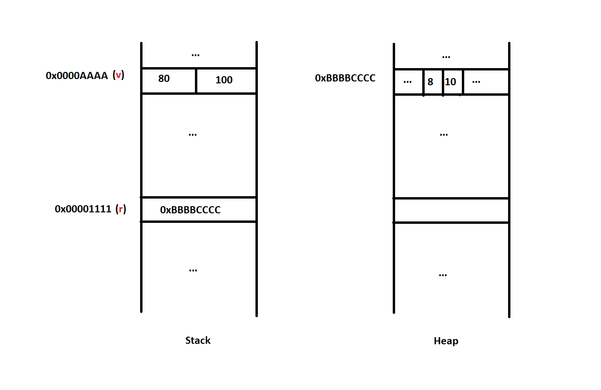

# Official Definition
As [*Microsoft Docs* says](https://docs.microsoft.com/en-us/dotnet/csharp/language-reference/builtin-types/value-types),
> *Value types* and reference types are the two main categories of C# types. A variable of a value type contains an instance of the type. This differs from a variable of a reference type, which contains a reference to an instance of the type. By default, on assignment, passing an argument to a method, and returning a method result, variable values are copied. In the case of value-type variables, the corresponding type instances are copied.

# Illustrate
Let's look at the code below, what does the two variables' memory layout look like?
``` cs
class RefType
{
    public int A { get; set; }
    public int B { get; set; }
}

struct ValType
{
    public int A { get; set; }
    public int B { get; set; }
}

var r = new RefType
{
    A = 8,
    B = 10,
};

var v = new ValType
{
    A = 80,
    B = 100,
};
```
